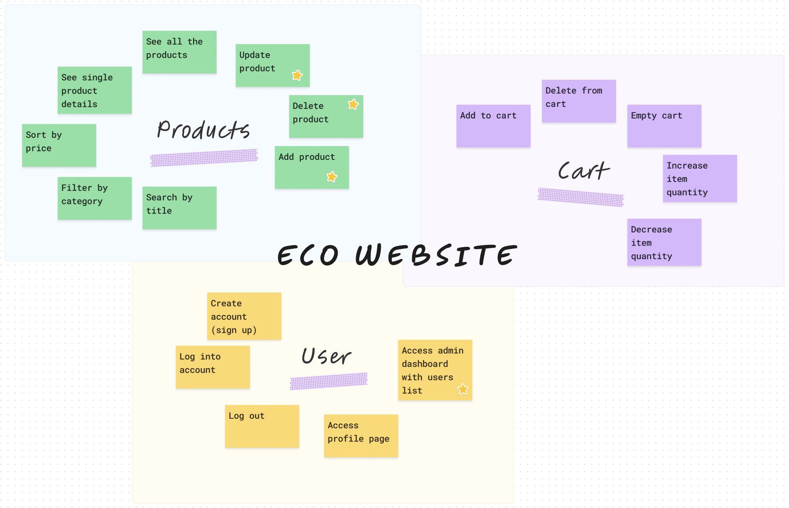

# Front-end Project - E-commerce website

This project is designed to represent an e-commerce website based on the [Platzi Fake Store API](https://fakeapi.platzi.com/) as a third-party tool providing all the information about the products, their categories and the users.

This project can be of interest for those who is building their webstore from scratch and need the core structure to start working with.

Overall, this project helps provide the basic operations with products, customers, and orders.

## Contents

- [Technologies](#technologies)
- [Getting Started](#getting-started)
- [Project Features](#project-features)
- [Architecture & Design](#architecture-&-design)
- [Testing](#testing)
- [Live Application](#live-application)

## Technologies


The project is build with Typescript and React.js using Redux Toolkit library as a tool for state management. Axios is used for implementing server data queries, React Router for creating the routing structure, and Material UI library and SCSS for styling.

## Getting Started

To start working with the project, clone the repo to your local machine using `git clone https://github.com/sytnikov/fs16_6-frontend-project.git`.

Create node.js environment by running `npm install`.

Use `npm install` to install dependencies to work with the project. Tip: if you are a MacOS user `brew install` can be considered as an alternative.

The list of all necessary dependencies can be found in `package.json`. No additional config files required.

Run `npm start` to start the application in the development mode. Open [http://localhost:3000](http://localhost:3000) to view it in the browser.

## Project features

The main project features are represented in the picture below. If the features is starred, it is accessible only for the users with the admin rights.



## Architecture & Design

According to the scope of the project, it was decided to use horizontal slice aka functional based architecture.

To manage the state globally Redux Toolkit library is used. There are 5 reducers responsible for state management.

Here's the list of the main pages of the app:

- Homepage/Store
- Single product
- Cart
- Profile
- Admin dashboard
- Signup and Login

There are also modals implemented to add and update products.

Below is the high-level project folder structure represented.

```
 .
 ├── public
 ├── src
 |  ├── components
 |  ├── hooks
 |  ├── img
 |  ├── pages
 |  ├── redux
 |  ├── routing
 |  ├── routing
 |  ├── types
 |  ├── App.tsx
 |  ├── index.scss
 |  ├── index.tsx
 |  ├── react-app-env.d.ts
 |  ├── reportWebVitals.ts
 |  └── setup.Tests.ts
 ├── .gitignore
 ├── package.json
 ├── project-features.png
 ├── README.md
 └── tsconfig.json
```

## Testing:

The test cases for all the Redux store reducers have been built with Jest testing library. In this porject, unit testing approach was used. The test requests are sent to the mock server not the real API.

Run `npm test` to implement all the tests.

## Live Application

Run `npm run build` to build the app for production to the `build` folder in the project directory. It will correctly bundle React in production mode and optimize the build for the best performance.

The app is deployed with [Vercel](https://vercel.com/).

[Click here](https://fs16-6-frontend-project-iota.vercel.app) to interact with the ECO website live.
